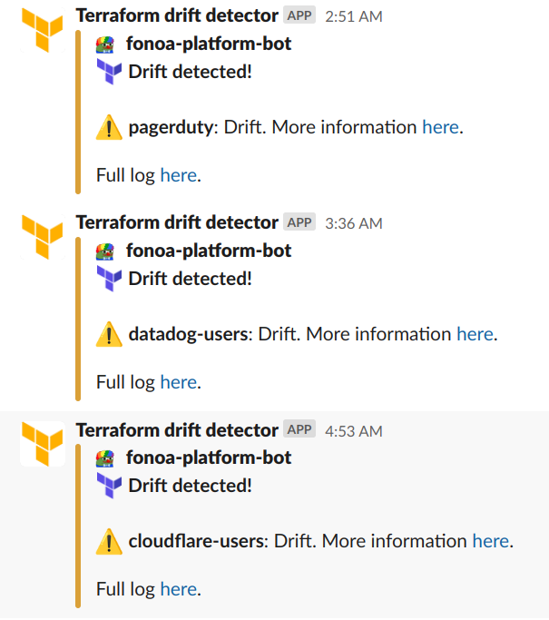

# tfe-drift-action

[](https://github.com/slok/tfe-drift-action/actions/workflows/ci.yaml)
[](https://raw.githubusercontent.com/slok/tfe-drift-action/master/LICENSE)
[](https://github.com/slok/tfe-drift-action/releases/latest)

## Introduction

[tfe-drift] Github action.

## Getting started

A very simple and example, execute every hour drift detection with a limit of plans:

```yaml
name: drift-detection

on:
  schedule:
    - cron:  '0 * * * *' # Every hour.

jobs:
  drift-detection:
    runs-on: ubuntu-latest
    steps:
      - uses: slok/tfe-drift-action@v0.4.0
        id: tfe-drift
        with:
          tfe-token: ${{ secrets.TFE_TOKEN }}
          tfe-org: myorg
          limit-max-plans: 3
```

## Input variables

- `tfe-token`: (Required) The Terraform API token.
- `tfe-org`: (Required) The Terraform cloud/enterprise organization to execute the drift detections.
- `not-before`: A time duration (e.g `1h`, `30m`) that will ignore the workspace if in the last specified duration, a drift detections has been already executed
- `limit-max-plans`: An integer that will limit the number of drift detections executed per run.
- `dry-run`: Will not execute any plan.
- `no-error`: Boolean that when enabled, will make the github action not fail when there is any drift or a any drift detection plan fails (used when you want more control using the action output result).
- `debug`: Boolean that will enable debug mode.
- `include-names`: String of comma separated regexes, that will exclude the workspaces that don't match these (e.g: dns,kubernetes-*,production-*).
- `exclude-names`: String of comma separated regexes, that will exclude the workspaces that match these (e.g: dns,kubernetes-*,production-*).
- `include-tags`: String of comma separated tags, that will exclude the workspaces that don't match these tags (e.g: production,infrastructure).
- `exclude-tags`: String of comma separated tags, that will exclude the workspaces that match these (e.g: production,infrastructure).

## Output variables

- `result`: JSON output with a result.

## Drift detection summary

When the action is executed, at the end it will set a drift detection summary with the link to all the plans:


## Usage

### Tagged workspaces

Only drift detect the tagged workspaces with `enable-drift-detection`

```yaml
name: Drift detection

on:
  schedule:
    - cron:  '0 * * * *' # Every hour.

jobs:
  drift-detection:
    runs-on: ubuntu-latest
    steps:
      - name: Drift detection
        uses: slok/tfe-drift-action@v0.4.0
        id: tfe-drift
        with:
          tfe-token: ${{ secrets.TFE_TOKEN }}
          tfe-org: myorg
          include-tags: "enable-drift-detection"
          limit-max-plans: 5
```

### JSON result for grain control

Using the JSON result to have more fine grain control.

```yaml
name: drift-detection

on:
  schedule:
    - cron:  '0 3 * * *' # Every day at 3am.

jobs:
  drift-detection:
    runs-on: ubuntu-latest
    steps:
      - uses: slok/tfe-drift-action@v0.4.0
        id: tfe-drift
        with:
          tfe-token: ${{ secrets.TFE_TOKEN }}
          tfe-org: myorg
          no-error: true

      - if: fromJSON(steps.tfe-drift.outputs.result).drift
        run: |
          # Do whatever...

          echo "Drift detected"
          exit 1

      - if: fromJSON(steps.tfe-drift.outputs.result).drift_detection_plan_error
        run: |
          # Do whatever...

          echo "Drift detection plan failed"
          exit 1
```

### Slack notification on drift

Sending a slack notification when there is are drifted workspaces.



```yaml
name: Drift detection

on:
  schedule:
    - cron:  '*/15 * * * *' # Every 15m.

jobs:
  drift-detection:
    runs-on: ubuntu-latest
    steps:
      - name: Drift detection
        uses: slok/tfe-drift-action@v0.4.0
        id: tfe-drift
        with:
          tfe-token: ${{ secrets.TFE_TOKEN }}
          tfe-org: myorg
          limit-max-plans: 3
          no-error: true

      - name: Prepare slack message
        id: slack-message
        if: ${{ !fromJSON(steps.tfe-drift.outputs.result).ok }}
        run: |
          # Store message as output.
          delimiter="$(openssl rand -hex 8)"
          echo "message<<${delimiter}" >> "${GITHUB_OUTPUT}"

          # Add an "invisible" character to force a new line and then set the information.
          echo '‎' >> "${GITHUB_OUTPUT}"
          echo '${{ steps.tfe-drift.outputs.result }}' | jq -r '.workspaces[] | select(.drift == true) | ":warning: *" + .name + "*: Drift. More information <"+ .drift_detection_run_url + "|here>."'  >> "${GITHUB_OUTPUT}"
          echo '${{ steps.tfe-drift.outputs.result }}' | jq -r '.workspaces[] | select(.drift_detection_plan_error == true) | ":x: *" + .name + "*: Drift detection failed. More information <"+ .drift_detection_run_url + "|here>."'  >> "${GITHUB_OUTPUT}"
          echo "" >> "${GITHUB_OUTPUT}"
          echo "" >> "${GITHUB_OUTPUT}"
          echo "Full log <${{ github.server_url }}/${{ github.repository }}/actions/runs/${{ github.run_id }}|here>." >> "${GITHUB_OUTPUT}"

          echo "${delimiter}" >> "${GITHUB_OUTPUT}"

      - name: Slack Notification
        if: ${{ !fromJSON(steps.tfe-drift.outputs.result).ok }}
        uses: rtCamp/action-slack-notify@v2
        env:
          SLACK_CHANNEL: terraform-drifts
          SLACK_COLOR: warning
          SLACK_ICON: https://i.imgur.com/qBAZZYs.png
          SLACK_USERNAME: "Terraform drift detector"
          SLACK_MESSAGE: "${{ steps.slack-message.outputs.message }}"
          SLACK_TITLE: ":terraform: Drift detected!"
          SLACK_WEBHOOK: ${{ secrets.SLACK_WEBHOOK }}
          SLACK_FOOTER: ""
          MSG_MINIMAL: "true"

```

[tfe-drift]: https://github.com/slok/tfe-drift
